# VaporBoy

<!-- Badges -->

[](https://travis-ci.org/torch2424/vaporBoy)


An _A E S T H E T I C_ GB / GBC Emulator PWA. Powered by [wasmBoy](https://github.com/torch2424/wasmBoy).

[Talk given at WebAssembly SF March 28th, 2019](https://youtu.be/ZlL1nduatZQ)

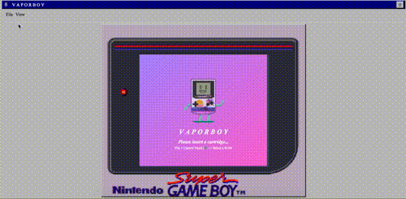

# Table of Contents

* [Features](#features)
* [Example Gifs &amp; Screenshots](#example-gifs--screenshots)
* [Lighthouse Score](#lighthouse-score)
* [Contributing](#contributing)
  * [Installation](#installation)
  * [Npm Scripts &amp; CLI Commands](#npm-scripts--cli-commands)
* [Special Thanks](#special-thanks)
* [Other Notes &amp; Links](#other-notes--links)
* [Privacy](#privacy)

# Features

* Emulates the Gameboy / Gameboy Color using [wasmBoy](https://github.com/torch2424/wasmBoy), for Web Assembly awesome-ness. 🎮👾🕹️

* Built as a [Progressive Web App(PWA)](https://developers.google.com/web/progressive-web-apps/), using [Preact](https://github.com/developit/preact). ⚛️

* Feel all of the VaporWave _N O S T A L G I A_, and appreciate the _A E S T H E T I C_ of [aesthetic-css](https://github.com/torch2424/aesthetic-css). 📼💜

* Upload your ROMs from anywhere. Local Device, Pre-loaded Open Source ROMS, and even cloud services! 🍺☁️

* Unique layouts for portrait (GBC), landscape (GBA), and desktop (SGB). 📱🖥️

* Keyboard, touch, and gamepad input support using [responsive gamepad](https://www.npmjs.com/package/responsive-gamepad). ⌨️ 🎮

* Supports all major browsers (Chrome, Firefox, Safari). Meaning, you can play gameboy on your iPhone! 🌐

* Installable using Desktop PWA Support and Mobile Browser's Add to Homescreen. 🖥️📱

* Have complete control of your emulation and performance with configurable settings and save states. ⚙️💾

* Experience the gameboy like you never have before, with Video/Audio altering VaporBoy effects. 🌈🔈📹

# Example Gifs & Screenshots

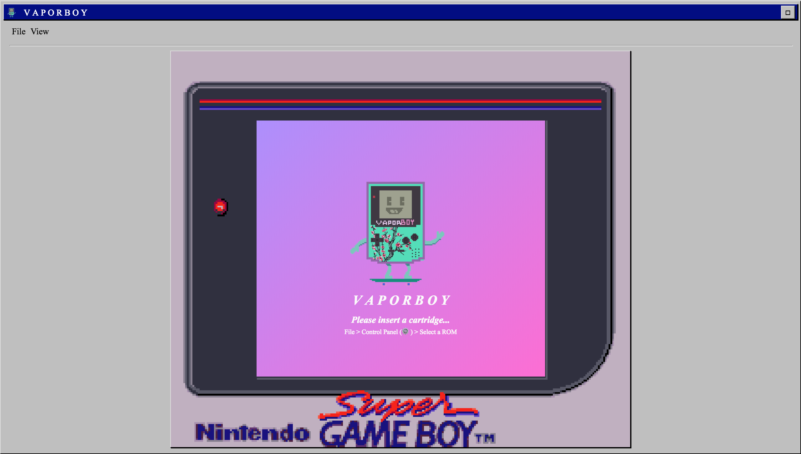 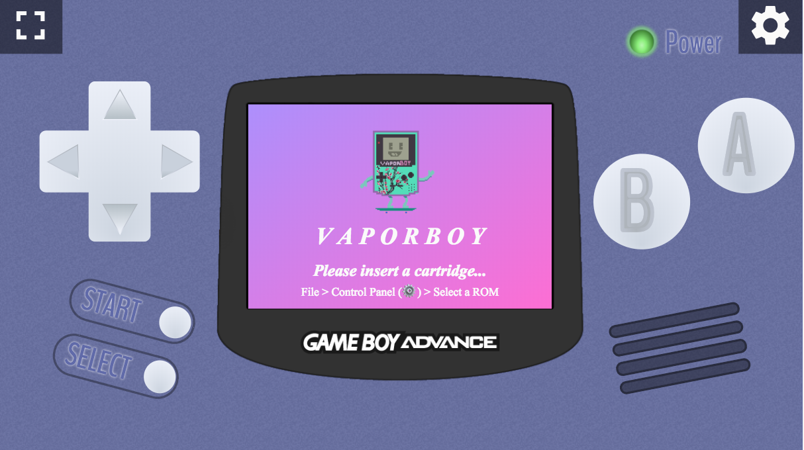 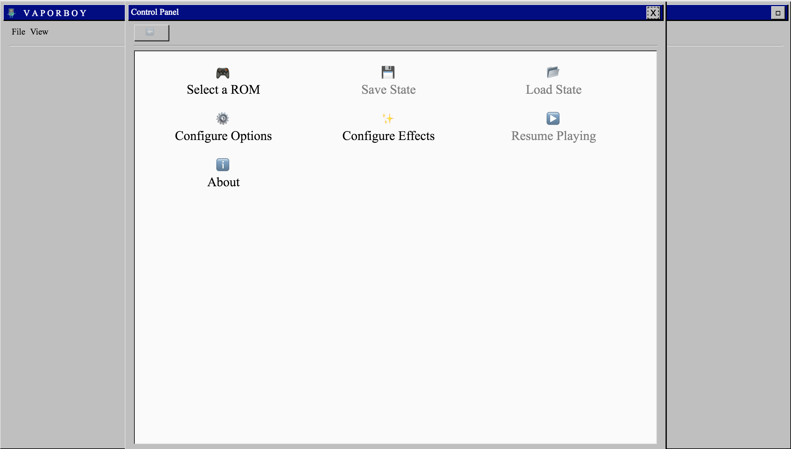 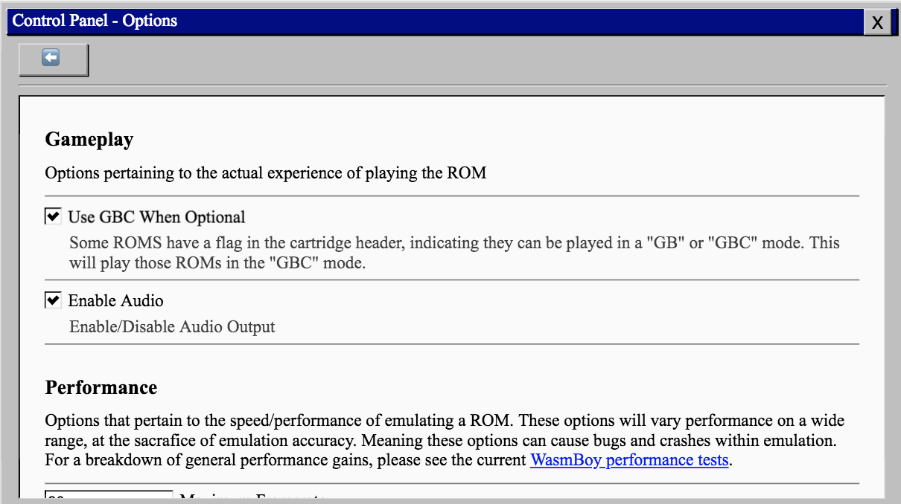

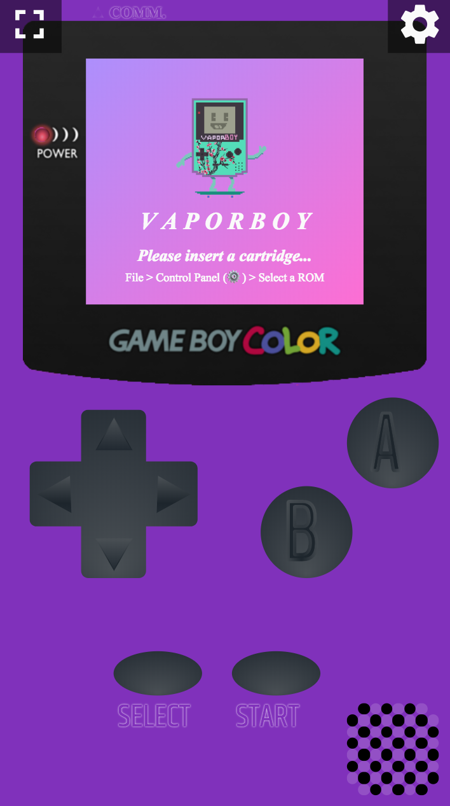 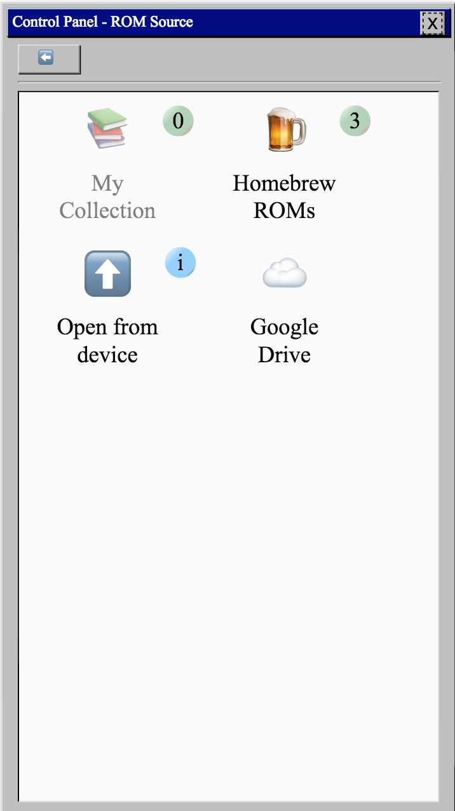 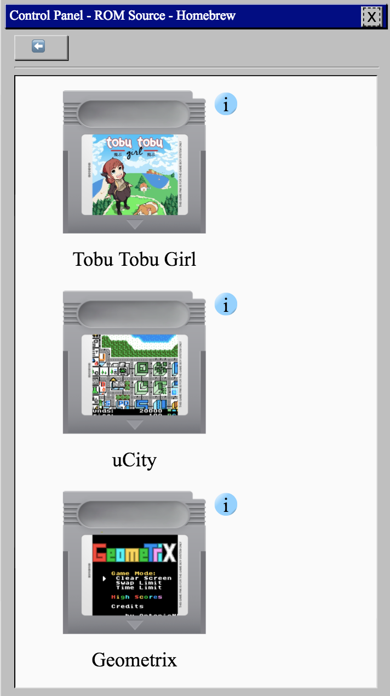 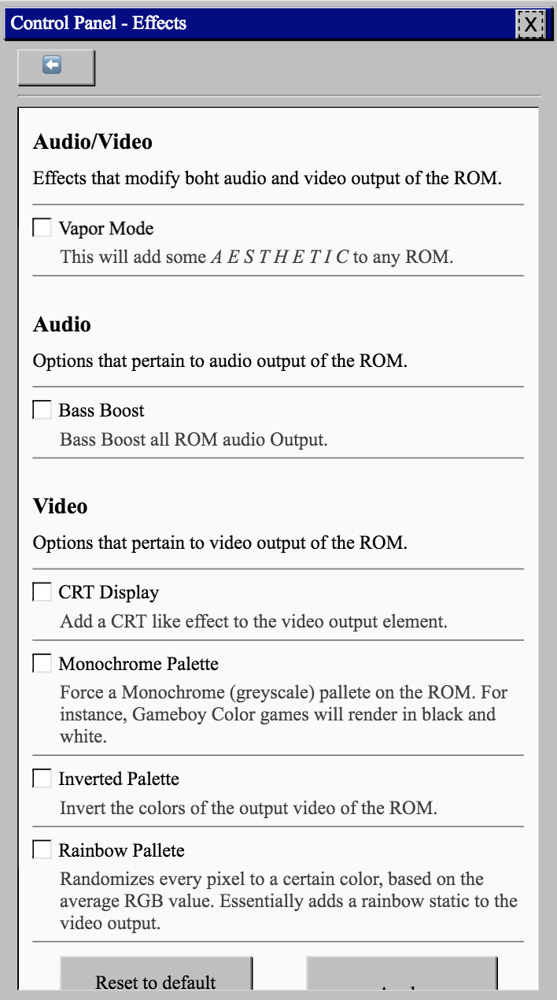 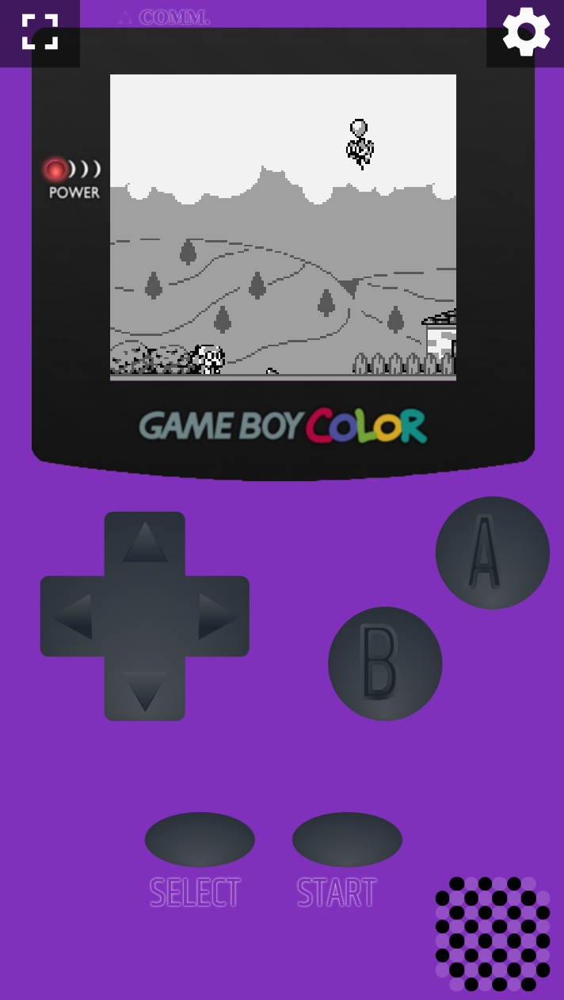

# Lighthouse Score

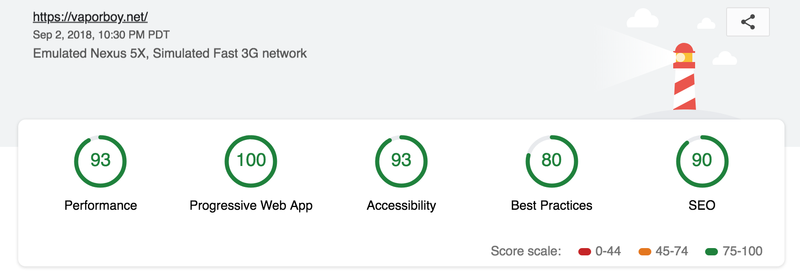

# Contributing

Feel free to fork and submit PRs! Any help is much appreciated, and would be a ton of fun! I would appreciate opening an issue, or replying to an already open issue to express intent of trying to solve the issue, and we discuss.

### Installation

Just your standard node app. Install Node with [nvm](https://github.com/creationix/nvm), `git clone` the project, and `npm install`, and you should be good to go!

### Npm Scripts & CLI Commands

```
# Starts the preact development server.
npm run start

# Same as `npm run start`
npm run dev

# Runs all precommit hooks
npm run precommit

# Runs the prettier linter, and automagically fixes all linting errors
npm run prettier:fix

# Builds a production version of the PWA
npm run preact:build

# Watches for changes, and continually builds/servers a production version of the PWA
npm run preact:build:watch

# Serves the locally built PWA
npm run preact:serve

# Serves the preact development server, called by `npm run start`
npm run preact:dev

# Start the cordova browser platform for development
npm run cordova:serve

# Serves the cordova (mobile) development server
npm run cordova:dev

# Start the electron server
npm run electron:serve

# Start the electron development server
npm run electron:dev
```

# Special Thanks

* [Leah Rose Garza](https://leahrosegarza.com/#/), Artist of the Vaporboy Logo.

* [awesome gb-dev communitty](https://github.com/avivace/awesome-gbdev), too many rad dudes to name!

* [dcodeIO for building and fixing bugs with AssemblyScript](https://github.com/AssemblyScript/assemblyscript). And for being awesome!

* [r/emudev](https://www.reddit.com/r/EmuDev/), especially to [binjimint](https://www.reddit.com/r/EmuDev/comments/7y2bux/gameboy_gb_graphical_bugs_game_writes_zeroes_into/dudlj3w/) for helping me sooooo much!

# Other Notes & Links

* [Talk given at WebAssembly SF March 28th, 2019](https://youtu.be/ZlL1nduatZQ)

* [SGB Borders](http://www.vgmuseum.com/features/sgb/#4s)

* [GBA Border](https://obsproject.com/forum/threads/gamepad-display.12508/page-5)

* [GBC Border](https://weheartit.com/entry/198414863)

* [Touchpad SVG Inspiration](http://distantfuturejosh.com/kungfu/)

* [Cartridge Border Images](http://hyperspin-fe.com/profile/3039-subzero/content/?type=forums_topic_post&page=76)

* [App Icon Generator](<https://romannurik.github.io/AndroidAssetStudio/icons-launcher.html#foreground.type=image&foreground.space.trim=1&foreground.space.pad=0.25&foreColor=rgba(96%2C%20125%2C%20139%2C%200)&backColor=rgb(68%2C%20138%2C%20255)&crop=0&backgroundShape=square&effects=none&name=ic_launcher>)

# Privacy

Analytics is used on this application simply for performance monitoring, and tracking popularity of the applications. The following events are sent, with nothing more than the event name. The analytics provider used is [Google Analytics](https://support.google.com/analytics/answer/6004245?ref_topic=2919631). 

**The Events sent are:**

- Save State Created
- Homebrew ROM Loaded
- My Collection ROM Loaded
- Scraper opened
- Manual reload
- Settings Applied
- Install opened
- Scraper skipped
- Scraper Search
- About Opened
- Scaper Manual Input
- Settings reset
- Google Drive ROM Load
